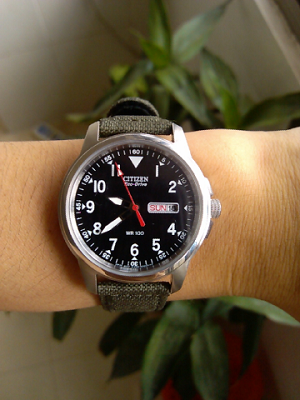
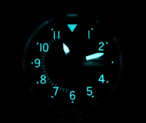

我对手表不是十分的感冒。 

小学时流行外形似call机的电子表，自己买了一个来玩，才几块钱。高中买过一个几十块钱的石英表，戴过一段时间，现在不知扔哪里了，估计在家里的某个角落吧。刚开始工作的那一年，因为软考，买了个2块钱的电子表看时间，现在估计也扔了。 
<!-- more -->
其实我一直想买块表，此事已纳入今年预算当中，只是没执行。一来对行情不了解，二来没时间调研适合自己实际情况的手表。偶然的机会，看到同事在网上海淘，也是买手表的，恰好，那个款式我比较喜欢，是光动能的，合适我这种懒人用。价格也不贵，72美金。于是趁此机会，叫同事顺便买一块。 可能是选的转运公司不给力，物流时间太长了。从6月底下单，到8月中旬我才拿到手。还不幸地被海关抽查，交了20%关税，后来和同事商量，关税平摊。这样总体价格还不算太高。与国内某宝上最低价格相差不大，但怎么说也是真正从美国发货(虽然是Made in Japan)。 

无论怎样，总算到手了，对于表带，虽然网上评论说不在好，但想想自己身份，暂时还是不换了，原装的挺好。 

手表参数如下：
型号:BM8180-03E
机芯:日本光动能机芯 
表壳直径:37毫米 
表壳厚度:9毫米 
表带材料:绿色帆布 
表带宽度:18毫米 
表盘颜色:黑色 
表壳材料:不锈钢 
日历:日期/星期 
防水深度:100米 
其它：红色秒针，夜光 表壳不大，适合我这种手细的人。 

以后有钱，打算换一块稍高档的，从目前来看，像我这种人是无法理解机械表的意义的，所以不会考虑。 

下面晒几张图片。本来想拍张夜光效果图的，但苦于无相机，小米手机又不给力，干脆不拍了。

